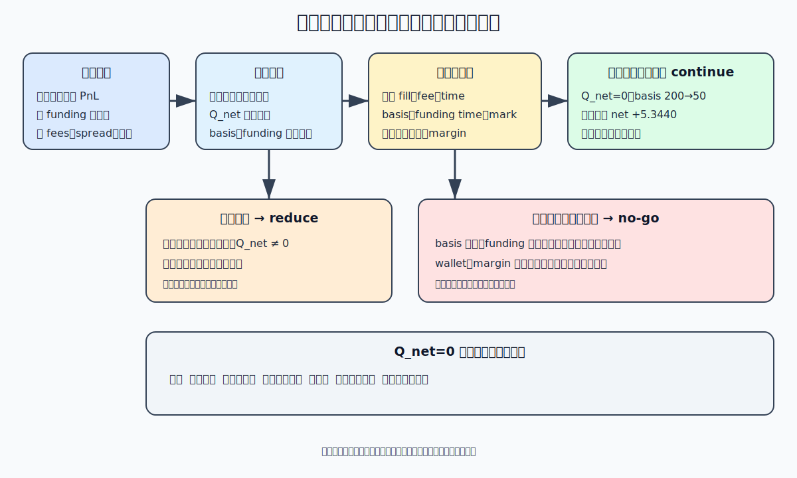
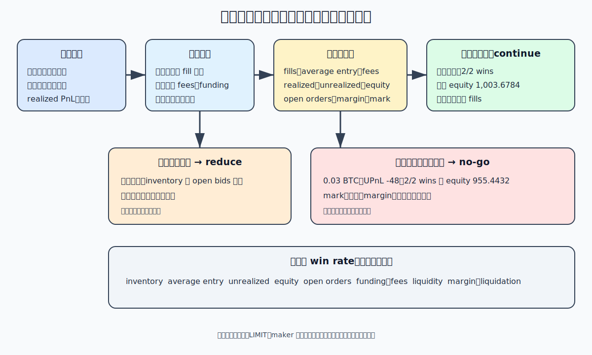

# 兩個訓練案例：中性不等於無風險，網格不等於穩定

> 配套基線：`emmet-qt-bt1 v0.3.0@c999965e5cc923281541409cda9502beb93b8a60`
> 內容狀態：穩定概念
> 最後驗證日期：2026-07-15

## 學習目標

完成本章後，你能：

1. 把期現資金費率案例的收益拆成基差價格損益、資金費與成本，而不是只看
   「收 funding」；
2. 用現貨腿與永續腿的帶方向數量計算淨敞口，辨認完整對沖、部分失衡與單腿
   未成交；
3. 逐筆核對永續網格的庫存、平均成本、已實現／未實現 PnL、費用與權益；
4. 解釋為什麼某一時點 `Q_net = 0` 仍有基差、執行、資金費、流動性、保證金與
   強平風險；
5. 把收益來源連到成立前提、可觀測證據、失效路徑與 continue／reduce／no-go
   決定，留下兩份可審核風險圖。

本章的價格、費率、成交序列與深度都是固定教學輸入，不是即時行情、可成交性、
策略績效或獲利承諾。兩個案例目前也不是 `v0.3.0` 已交付的讀者策略入口。

## 問題情境：兩句聽來安全、其實不完整的話

你可能聽過：

```text
期現同時做多與做空，所以市場漲跌都沒關係。
網格每跌一格買、每漲一格賣，所以震盪時會一直累積小利。
```

兩句話都只說了收益機制，沒有說成立前提。

- 期現案例要靠兩腿數量與時點匹配、基差依預期變化、資金費方向沒有翻轉，且
  成本、保證金與流動性仍可承受。
- 網格要靠價格重複穿越相鄰格位、掛單真的成交，而且單邊趨勢時累積的庫存仍在
  限額內。

專業判斷不能把「有一條可能賺錢的路」改寫成「沒有虧錢的路」。

## 執行前預測

先不要算，寫下你的答案：

1. 現貨 `+0.10 BTC`、永續 `-0.10 BTC` 時，`Q_net` 是否為零？若只有永續
   `-0.06 BTC` 成交呢？
2. 期現完整對沖後，永續相對現貨的基差由 `200` 收斂到 `50 USDT/BTC`，價格
   損益應為正還是負？
3. 正資金費時永續空頭收到 funding；若費率翻成足夠大的負值，原本的收益是否
   還成立？
4. 網格完成兩次獲利循環後又連續買進三格，已實現 PnL 為正，總權益是否也必然
   高於初始值？
5. LIMIT／maker 掛單尚未成交時，能否先把預期價差與 maker 費率記為已實現收益？

把答案保留到兩個案例的 oracle 後再修改；不要只留下最後的正確答案。

## 先把「中性」拆成可以檢查的句子

本章以 `Q_spot` 表示現貨帶方向數量，以 `Q_perp` 表示 U 本位線性永續帶方向數量：

```text
Q_net = Q_spot + Q_perp                       [BTC]
```

現貨多頭為正，永續空頭為負。`Q_net = 0` 只表示在這個數量近似下，共同方向的一階
價格曝險互相抵銷。它沒有證明：

- 現貨價與永續價永遠同步；
- 兩腿能在同一時間、同一數量成交；
- 資金費方向與間隔不變；
- 任一錢包都有足夠現金、保證金或可用餘額；
- 平倉時仍有足夠深度，也沒有跳價、下架或清算事件。

所以本章不說「市場中性策略」，而說得更精確：**某一快照的共同方向淨數量為零**。

## 案例 A：期現資金費率不是只收 funding

### 固定情境與符號

全部數字都是教學輸入：

| 輸入 | 現貨腿 | 永續腿 |
|---|---:|---:|
| 帶方向數量 | `Q_spot = +0.10 BTC` | `Q_perp = -0.10 BTC` |
| 進場參考價 | `S0 = 20,000` | `P0 = 20,200` |
| 出場參考價 | `S1 = 20,400` | `P1 = 20,450` |
| 實際進場成交價 | `20,010` | 空單賣出 `20,185` |
| 實際出場成交價 | 賣出 `20,390` | 空單買回 `20,465` |
| 手續費率 | `0.001` | `0.0004` |
| 結算標記價／單次費率 | 不適用 | `20,200`／`+0.0005` |

定義永續減現貨的基差：

```text
B_t = P_t - S_t                              [USDT/BTC]
```

本例進場 `B0 = 200`、出場 `B1 = 50 USDT/BTC`。正基差由大變小是收斂；這只是
本例觀察，不代表未來一定收斂。

### 先核對淨數量

```text
Q_net = +0.10 + (-0.10)
      = 0.00 BTC
```

這一步限制共同方向曝險，不能拿來刪掉後面的基差、資金費或成交成本欄位。

### 參考價格損益：收益來自基差收斂

```text
spot reference PnL = (S1 - S0) × Q_spot
                   = (20,400 - 20,000) × 0.10
                   = +40.00 USDT

perp reference PnL = (P1 - P0) × Q_perp
                   = (20,450 - 20,200) × (-0.10)
                   = -25.00 USDT

gross reference price PnL = 40.00 - 25.00
                          = +15.00 USDT
                          = (B0 - B1) × 0.10
```

兩個市場都上漲，現貨賺 `40`、永續空單虧 `25`；組合仍賺 `15`，因為正基差縮小。
「一多一空」不是收益解釋，「基差由 `200` 收斂到 `50`」才是。

### 實際成交與價格摩擦：不要再重扣一次

用實際成交價重算：

```text
spot fill PnL = (20,390 - 20,010) × 0.10 = +38.00 USDT
perp fill PnL = (20,465 - 20,185) × (-0.10) = -28.00 USDT
fill price PnL = +10.00 USDT
price friction attribution = 15.00 - 10.00 = 5.00 USDT
```

`5.00` 是參考價到成交價的 spread／滑點歸因，已經反映在 `10.00` 的成交價損益。
若又從 `10.00` 扣 `5.00`，就是重複扣除。

### 手續費與 funding 都是獨立現金流

```text
spot fees = (20,010 + 20,390) × 0.10 × 0.001
          = 4.0400 USDT

perp fees = (20,185 + 20,465) × 0.10 × 0.0004
          = 1.6260 USDT

funding cash flow = -Q_perp × mark × rate
                  = -(-0.10) × 20,200 × 0.0005
                  = +1.0100 USDT
```

正費率下，這個永續空頭收到 `1.0100 USDT`。它進期貨錢包，不會自動補進現貨
錢包；若需要 transfer，那是另一筆事件。

### 組合結果：每筆只算一次

```text
net PnL = fill price PnL + funding - spot fees - perp fees
        = 10.0000 + 1.0100 - 4.0400 - 1.6260
        = +5.3440 USDT
```

等價歸因為：

```text
15.0000 reference gross
-5.0000 spread/slippage attribution
+1.0100 funding
-4.0400 spot fees
-1.6260 perp fees
=5.3440 net
```

這是固定單次情境的核帳結果，不是年化收益、真實容量或策略績效。

### 三條失效路徑

| 情境 | 關鍵數字 | 證據解讀 | 決定 |
|---|---:|---|---|
| 完整對沖、基差收斂 | `Q_net=0`、`B: 200→50`、net `+5.3440` | 本次固定輸入通過核帳；仍需監控 funding、兩腿與保證金 | `continue` 只限此證據快照 |
| 永續只成交 `-0.06 BTC` | `Q_net=+0.04 BTC` | 共同上漲 `1,000 USDT/BTC` 約增加 `+40 USDT` 方向 PnL；反向亦會虧 | 立即 `reduce`，停止增加曝險 |
| 基差擴到 `400` | reference price PnL `-20`、同成本下 net `-29.6560` | 收斂假設失敗，funding 不足以補價格與成本 | `no-go`／依預先退出規則處理 |
| 費率反轉為 `-0.003` | funding `-6.0600`、net `-1.7260` | 空頭由收取改為支付，收益來源反轉 | `no-go`，不把舊費率外推 |

單腿情境中的 `+40` 不是好消息，而是警報：同一個殘留敞口在反方向會造成
`-40 USDT`，且價格跳動越大，損益越大。真正的系統還要處理拒單、部分成交、
逾時與補救；Phase 4 的多腿協調尚未發布，本章不虛構它的操作入口。

### 期現案例風險圖



純文字重述：收益候選是「基差收斂的價格損益，加 funding，減成交摩擦與費用」。
成立前提是兩腿數量與時點可對齊、資金費方向仍成立，且兩錢包、流動性、保證金
與強平緩衝均通過。若 `Q_net != 0`、一腿未成交或證據缺失，先停止新增並
`reduce`；若基差超過預設失效界線、費率反轉使 net 不為正，或任一錢包／強平
邊界失守，結論是 `no-go`。只有所有證據在同一版本與時點通過，才是有條件的
`continue`。

## 案例 B：永續網格的高勝率可以和大虧損同時存在

### 固定規則與帳本邊界

這是一個只做多方向庫存的線性永續教學序列：每格 `0.01 BTC`，成交費率固定
`0.0004`，初始 futures wallet balance 為 `1,000 USDT`。LIMIT／maker 只是掛單
意圖；下表只有標為 fill 的事件才入帳，且費率是情境輸入，不代表真實帳戶費率。

每次增加同方向庫存時：

```text
Q_after = Q_before + q
avg_after = (abs(Q_before) × avg_before + q × fill_price) / abs(Q_after)
fee = q × fill_price × fee_rate
```

賣出不超過既有多頭數量時：

```text
realized_delta = (sell_price - avg_before) × q
wallet_after = wallet_before + realized_delta - fee
```

指定 mark 下：

```text
unrealized = (mark - avg_entry) × Q
equity = wallet + unrealized
```

這是帳本算式，不是完整交易所保證金、清算或稅務帳單。

### 區間震盪：兩次小利確實發生

| 事件 | fill | 成交後 `Q` | 平均成本 | 累計已實現 | 累計費用 | wallet／equity |
|---|---:|---:|---:|---:|---:|---:|
| `t1` 買 | `20,000` | `+0.01` | `20,000` | `0` | `0.0800` | `999.9200` |
| `t2` 賣 | `20,200` | `0` | 不適用 | `+2.0000` | `0.1608` | `1,001.8392` |
| `t3` 買 | `20,000` | `+0.01` | `20,000` | `+2.0000` | `0.2408` | `1,001.7592` |
| `t4` 賣 | `20,200` | `0` | 不適用 | `+4.0000` | `0.3216` | `1,003.6784` |

兩個已完成循環都是贏家，cycle win rate 是 `2/2 = 100%`；平倉後沒有未實現
PnL，所以此時權益等於 wallet。這是「區間真的往返且訂單真的成交」的結果。

### 單邊下跌：小利留著，庫存繼續長大

接著價格不再反彈，三張買單依序成交：

| 事件 | fill／mark | 成交後 `Q` | 平均成本 | wallet | 未實現 PnL | equity |
|---|---:|---:|---:|---:|---:|---:|
| `t5` 買 | `19,800`／`19,800` | `+0.01` | `19,800` | `1,003.5992` | `0.0000` | `1,003.5992` |
| `t6` 買 | `19,600`／`19,600` | `+0.02` | `19,700` | `1,003.5208` | `-2.0000` | `1,001.5208` |
| `t7` 買 | `19,400`／`19,400` | `+0.03` | `19,600` | `1,003.4432` | `-6.0000` | `997.4432` |
| 重估 | mark `18,000` | `+0.03` | `19,600` | `1,003.4432` | `-48.0000` | `955.4432` |

到最後一列：

```text
total result = realized PnL - fees + unrealized PnL
             = 4.0000 - 0.5568 - 48.0000
             = -44.5568 USDT

equity - initial equity = 955.4432 - 1,000
                        = -44.5568 USDT
```

已完成循環仍然是 `2/2` 勝，已實現 PnL 仍為 `+4`；總權益卻已低於初始值
`44.5568 USDT`。勝率沒有包含未平倉庫存的尾部風險。

### 剩餘掛單也是待承擔曝險

假設下方還留著兩張各 `0.01 BTC` 的買單，價格為 `19,200` 與 `19,000`。它們現在
尚未成交，所以不能先改 wallet 或 inventory；但最壞掛單簿要問「若兩張都在下跌中
成交」：

```text
Q: 0.03 → 0.05 BTC
average entry: 19,600 → 19,400 USDT/BTC
additional fees: 0.1528 USDT
unrealized at mark 18,000: (18,000 - 19,400) × 0.05 = -70.0000 USDT
stressed equity: 933.2904 USDT
```

未成交不等於沒有風險：它不是已發生的會計事件，卻是已授權的潛在曝險。若
流動性不足或價格跳過格位，也可能完全不按這個序列成交。

### 永續網格案例風險圖



純文字重述：網格收益候選來自價格反覆穿越格位後完成買低賣高的循環。成立前提
是掛單實際成交、往返頻率足以覆蓋費用與 funding，而且最大庫存、剩餘掛單、
流動性、保證金與強平緩衝仍可承受。區間內且所有風險欄位通過，只能有條件
`continue`；庫存或最壞掛單曝險接近限額時取消新增掛單並 `reduce`；單邊趨勢、
權益跌破門檻、mark／funding 證據缺失或強平邊界失守時 `no-go`。已完成循環勝率
不能覆蓋這些欄位。

## 動手驗證：一次重算兩份帳

先依[實作準備](../front-matter/setup.md)進入乾淨的固定配套 worktree，核對 HEAD 與
lockfile；這個指令只使用 Python 標準庫，但仍由相同 locked Python 執行：

```bash
cd ../emmet-qt-bt1-v0.3.0
git rev-parse HEAD
git status --short
uv lock --check
uv run python - <<'PY'
from decimal import Decimal as D, getcontext

getcontext().prec = 28

# 案例 A：期現資金費率
q = D("0.10")
spot_q, perp_q = q, -q
s0, p0 = D("20000"), D("20200")
s1, p1 = D("20400"), D("20450")
b0, b1 = p0 - s0, p1 - s1
spot_ref = (s1 - s0) * spot_q
perp_ref = (p1 - p0) * perp_q
gross_ref = spot_ref + perp_ref
assert spot_q + perp_q == D("0")
assert (b0, b1, gross_ref) == (D("200"), D("50"), D("15"))

spot_buy, spot_sell = D("20010"), D("20390")
perp_open, perp_close = D("20185"), D("20465")
spot_fill = (spot_sell - spot_buy) * spot_q
perp_fill = (perp_close - perp_open) * perp_q
fill_price_pnl = spot_fill + perp_fill
price_friction = gross_ref - fill_price_pnl
spot_fees = (spot_buy + spot_sell) * q * D("0.001")
perp_fees = (perp_open + perp_close) * q * D("0.0004")
funding = -perp_q * D("20200") * D("0.0005")
net = fill_price_pnl + funding - spot_fees - perp_fees
assert (spot_fill, perp_fill, price_friction) == (D("38"), D("-28"), D("5"))
assert (spot_fees, perp_fees, funding, net) == (
    D("4.0400"), D("1.62600"), D("1.010000"), D("5.344000")
)
print("basis-ledger=PASS net=5.344000")

partial_perp_q = D("-0.06")
q_net_partial = spot_q + partial_perp_q
directional_move_pnl = q_net_partial * D("1000")
expanded_basis_gross = (b0 - D("400")) * q
expanded_basis_net = expanded_basis_gross + funding - price_friction - spot_fees - perp_fees
reversed_funding = -perp_q * D("20200") * D("-0.003")
reversed_net = fill_price_pnl + reversed_funding - spot_fees - perp_fees
assert (q_net_partial, directional_move_pnl) == (D("0.04"), D("40"))
assert expanded_basis_net == D("-29.656000")
assert reversed_net == D("-1.72600")
print("basis-scenarios=PASS partial-q-net=0.04 expansion=-29.656000 reversal=-1.72600")

# 案例 B：永續網格
fee_rate = D("0.0004")
step = D("0.01")
wallet = D("1000")
qty = D("0")
entry = D("0")
realized = D("0")
fees = D("0")

def fill(side: str, price: D, mark: D) -> tuple[D, D]:
    global wallet, qty, entry, realized, fees
    delta = step if side == "buy" else -step
    fee = step * price * fee_rate
    fees += fee
    if qty == 0 or qty * delta > 0:
        new_qty = qty + delta
        entry = (abs(qty) * entry + abs(delta) * price) / abs(new_qty)
        qty = new_qty
        realized_delta = D("0")
    else:
        closed = min(abs(qty), abs(delta))
        direction = D("1") if qty > 0 else D("-1")
        realized_delta = (price - entry) * closed * direction
        new_qty = qty + delta
        qty = new_qty
        if new_qty == 0:
            entry = D("0")
        elif qty * direction < 0:
            entry = price
    realized += realized_delta
    wallet += realized_delta - fee
    unrealized = (mark - entry) * qty if qty else D("0")
    return unrealized, wallet + unrealized

fill("buy", D("20000"), D("20000"))
fill("sell", D("20200"), D("20200"))
fill("buy", D("20000"), D("20000"))
_, range_equity = fill("sell", D("20200"), D("20200"))
assert (qty, realized, fees, wallet, range_equity) == (
    D("0"), D("4"), D("0.3216"), D("1003.6784"), D("1003.6784")
)
print("grid-range=PASS completed-wins=2/2 equity=1003.6784")

fill("buy", D("19800"), D("19800"))
fill("buy", D("19600"), D("19600"))
fill("buy", D("19400"), D("19400"))
unrealized = (D("18000") - entry) * qty
equity = wallet + unrealized
assert (qty, entry, realized, fees) == (D("0.03"), D("19600"), D("4"), D("0.5568"))
assert (unrealized, wallet, equity, equity - D("1000")) == (
    D("-48.00"), D("1003.4432"), D("955.4432"), D("-44.5568")
)
print("grid-trend=PASS inventory=0.03 unrealized=-48.00 equity=955.4432")

remaining = [(D("0.01"), D("19200")), (D("0.01"), D("19000"))]
stressed_qty = qty + sum((size for size, _ in remaining), D("0"))
stressed_cost = qty * entry + sum((size * price for size, price in remaining), D("0"))
stressed_entry = stressed_cost / stressed_qty
additional_fees = sum((size * price * fee_rate for size, price in remaining), D("0"))
stressed_wallet = wallet - additional_fees
stressed_unrealized = (D("18000") - stressed_entry) * stressed_qty
stressed_equity = stressed_wallet + stressed_unrealized
assert (stressed_qty, stressed_entry, additional_fees) == (
    D("0.05"), D("19400"), D("0.1528")
)
assert (stressed_unrealized, stressed_equity) == (D("-70.00"), D("933.2904"))
print("remaining-orders=PASS inventory=0.05 stressed-equity=933.2904")
PY
```

預期最後依序看到：

```text
basis-ledger=PASS net=5.344000
basis-scenarios=PASS partial-q-net=0.04 expansion=-29.656000 reversal=-1.72600
grid-range=PASS completed-wins=2/2 equity=1003.6784
grid-trend=PASS inventory=0.03 unrealized=-48.00 equity=955.4432
remaining-orders=PASS inventory=0.05 stressed-equity=933.2904
```

任一數字不同都先停下來找現金流、數量、方向或費用重複計算，不要調整預期值
讓它通過。

## 系統對照：帳本原語已發布，兩個策略尚未交付

`emmet-qt-bt1 v0.3.0` 可支持本章的概念核對：

| 已發布證據 | 本章使用方式 | 不能宣稱 |
|---|---|---|
| `Position.signed_qty`、`entry_price`、`mark_price` | 核對永續帶方向數量、平均成本與 `(mark-entry)×qty` | 已有網格策略產品 |
| `FuturesWallet`、`AccountState` | 核對期貨 wallet、現貨／期貨分離與權益 | 兩錢包可任意互補 |
| `AccountingLedger` futures fill | 核對加倉平均成本、減倉 realized PnL 與 fee 入帳 | LIMIT／maker 一定成交 |
| funding posting | 核對 `-qty×mark×rate` 與獨立現金流 | 未來費率、固定間隔或收益 |
| 保證金與清算模型 | 要求把 margin／liquidation 放進風險圖 | 交易所精確清算帳單 |

Phase 4 的多腿協調、組合風控、完整 Strategy API／Engine 入口仍未發布。`v0.3.0`
內部模型與測試能支撐「公式與帳本邊界存在」，不能支持「期現策略已能安全自動
運行」或「永續網格已交付」。本章沒有從開發分支取證。

Binance 第一手公開資料在 2026-07-15 重新核對：funding history 分列
`fundingRate`、`fundingTime`、`markPrice`；funding info 另有
`fundingIntervalHours`；premium index 分列 `markPrice`、`indexPrice`、
`lastFundingRate` 與 `nextFundingTime`。Spot 固定文件則把 `LIMIT_MAKER` 定義為
若會立即以 taker 成交就拒絕的 post-only 類訂單。這些欄位與產品語義不支持本章
固定數字、可成交性或未來費率。

## 證據顯示什麼

兩份帳共同推翻四個捷徑：

1. `Q_net=0` 不等於所有風險為零；它只核對一個方向數量。
2. 收到 funding 不等於組合賺錢；基差、費用與兩腿成交可以蓋過它。
3. 已實現 PnL 與勝率不等於總權益；未平倉庫存可以同時產生更大的未實現虧損。
4. 未成交掛單不是已實現收益；它是需要納入最壞掛單簿的潛在曝險。

這些結論不需要先相信策略名稱，只需要逐項通過數量、現金流與權益 oracle。

## 結果解讀與決定

### 期現案例

- `continue`：只在兩腿、`Q_net`、basis、funding、費用、流動性、兩錢包與強平
  緩衝都屬同一快照且通過預設門檻時成立。
- `reduce`：一腿未成交、部分成交或 `Q_net` 超限時，停止新增曝險，依預先授權
  的安全路徑處理殘留腿；本章不虛構 Phase 4 補救入口。
- `no-go`：basis 失效、funding 反轉使 net 不為正、成本證據不足、錢包或保證金
  邊界失守時，停止把案例當成收益候選。

### 永續網格

- `continue`：只在實際 fills、總權益、庫存、剩餘掛單、費用、funding、流動性與
  強平緩衝都通過時成立；不能只看已完成循環。
- `reduce`：庫存或最壞掛單曝險接近限額時，取消新增意圖並降低部位；取消是否
  成功仍需交易所回報。
- `no-go`：單邊趨勢使權益或保證金跌破門檻、mark 過期、深度不足或清算風險
  失守時停止。`100%` 已完成循環勝率不能覆寫此決定。

門檻要在看結果前寫入實驗契約。本章沒有提供通用百分比，因為可接受損失、容量、
保證金與產品規則都必須綁定版本、帳戶與研究目的。

## 常見陷阱

- 把 `Q_net=0` 寫成「沒有風險」，漏掉 basis 與兩腿成交時點。
- 用永續名義價值加進現貨資產，製造不存在的 BTC 或重複權益。
- 價格 PnL 已用實際 fill，仍再扣一次 spread／slippage。
- 只保存 funding rate，不保存 funding time 與相符 mark。
- 把本期正 funding 外推成下一期，或硬編固定八小時。
- 把 LIMIT／maker 意圖當成 fill，預先記入價差與 maker 費率。
- 只數已完成獲利循環，不把未平倉庫存、剩餘掛單與 unrealized PnL 放進權益。
- 以「網格會再漲回來」代替庫存上限、停止條件與強平檢查。
- 把教學成交序列、費率或深度冒充即時市場或真實容量。
- 從 Phase 4 開發分支借用多腿協調或組合風控輸出，寫成已發布能力。

## 對系統的回饋

本章可形成兩組未來系統驗收需求，但不是自行補一套交易引擎：

1. 期現案例應輸出每腿 intended／filled quantity、時間、fill、fee、funding、basis、
   `Q_net`、wallet 與失衡處置；任何一腿證據缺失都 fail closed。
2. 網格報告應同時輸出 realized／unrealized PnL、fees、funding、inventory、average
   entry、equity、open orders 與 worst-open-order exposure；勝率不能是唯一風險欄。
3. 圖中的 continue／reduce／no-go 節點可轉成 Phase 4 之後的規格與測試 oracle；
   在正式介面發布前，只保存需求與本章固定重現，不創造假入口。

## 小結與練習

本章的核心不是記住兩個策略名稱，而是建立一條不能跳步的判斷鏈：

```text
收益來源 → 成立前提 → 風險事件 → 可觀測證據 → continue／reduce／no-go
```

練習：

1. 把期現案例的永續成交量改成 `-0.08 BTC`，計算 `Q_net` 與共同價格變動
   `-1,500 USDT/BTC` 時的方向 PnL；寫出 reduce 條件。
2. 保持數量完整對沖，把出場 basis 改成 `-50` 與 `350 USDT/BTC`，分別重算
   reference gross PnL；不要修改 funding 或成本來美化結果。
3. 在網格帳加入一筆 `19,200` 買單 fill，再以 `17,500` mark 重估；逐項核對
   wallet、average entry、unrealized 與 equity。
4. 為兩張圖各寫一條你自己的 no-go 門檻，標明需要的資料、時點、版本與缺證時
   的處置。練習不使用真實資金或私人 API key。

## 專業紀錄：兩案例收益來源／失效條件圖

完成本章後保存：

```text
案例：期現資金費率／永續網格
版本：v0.3.0@c999965e5cc923281541409cda9502beb93b8a60
教學輸入或資料版本：
收益來源：
成立前提：
每腿／每筆成交證據：
fees／spread／slippage／funding：
Q_net 或 inventory／average entry：
realized／unrealized／equity：
open orders／worst exposure：
margin／liquidation 緩衝：
失效條件：
決定：continue／reduce／no-go
決定理由與缺失證據：
檢查日期：
```

## 作者驗證紀錄

- 驗證對象：兩案例 Decimal 手算帳、基差／淨敞口、網格庫存／權益、兩張離線
  風險圖、已發布模型邊界與 Binance 第一手公開欄位
- 對照 tag／commit：`v0.3.0@c999965e5cc923281541409cda9502beb93b8a60`
- 驗證環境：Linux／Bash、uv 0.10.4、Python 3.12.3、隔離且乾淨的固定 worktree
- 驗證命令：
  - `git rev-parse HEAD`
  - `git status --short`
  - `uv lock --check`
  - 章內 `uv run python` Decimal 重算
  - `uv run pytest tests/unit/test_models_account.py tests/unit/test_engine_accounting.py tests/unit/test_engine_funding.py -q`
  - `git diff --check`
  - `EMMET_QT_BT1_DIR="$EMMET_QT_BT1_DIR" ./scripts/book-check`
- 通過結果：五組 Decimal PASS markers、已發布聚焦測試與完整 book check 均通過；
  兩張 SVG 由離線出版與 HTML resource／link check 解析
- 待處理差異：Phase 4 多腿協調、組合風控、正式策略／Engine 入口尚未發布；固定
  情境不包含真實排隊、完整 order book、市場衝擊、ADL、下架、保險基金、多資產
  模式、稅務或交易所最終清算帳單；外部文件發布前仍須重驗
